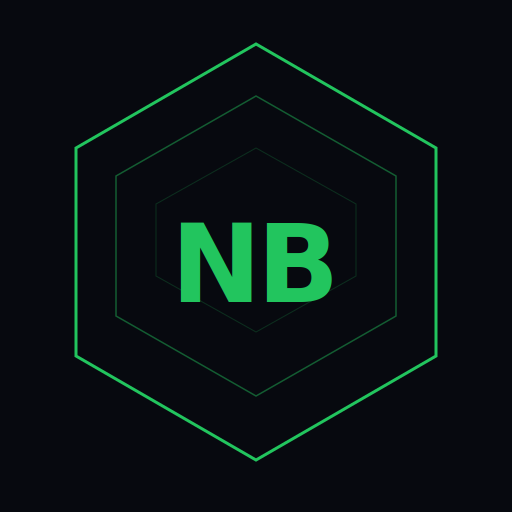

<div align="center">

<div></div>

<div></div>

# NovaByte Studio

**A desktop IDE for building and packaging `.novaapp` applications —**
**compatible with every NBOSP fork and [NovaByte OS v3](https://github.com/NovaByteTeam/novabyte-os).**

<br>

[](https://github.com/NovaByteOfficial/novapack-studio)
[](https://github.com/NovaByteTeam/novabyte-os)
[](https://nodejs.org)
[](#)
[](https://github.com/NovaByteOfficial/novapack-studio/releases)
[](#license)

<br>

[**Getting Started**](#getting-started) · [**Manifest Format**](#manifest-format) · [**App Runtime**](#app-runtime) · [**Permissions**](#permissions) · [**Private Storage**](#private-storage) · [**IPC API**](#ipc-api-windownova) · [**Background Execution**](#background-execution-novabackground) · [**Security**](#security) · [**Getting Verified**](#how-to-get-your-novaapp-verified) · [**Distribution**](#distribution)

</div>

---

## What is NovaByte Studio

NovaByte Studio is a desktop IDE (built on NW.js) for creating, building, and packaging `.novaapp` applications. It gives you a GUI to scaffold new projects from templates, edit your code with a full-featured CodeMirror 6 editor, manage your manifest and permissions, build your package, and inspect the output — all without touching a CLI.

Apps you build with Studio run on NovaByte OS v3 and every NBOSP fork. The `.novaapp` format is the same across all of them.

---

## Download

NovaByte Studio is available for Windows, macOS, and Linux. Download the latest release for your platform from the [Releases](https://github.com/NovaByteOfficial/novapack-studio/releases) page, extract the archive, and run the executable — no install required.

---

## Getting Started

### Prerequisites

- Basic HTML, CSS, and JavaScript knowledge

### Available templates

| Template | Description |
|----------|-------------|
| `blank` | Empty shell — start from scratch |
| `webapp` | Pins one external site as its own app — fixed URL, no address bar or navigation |
| `browser` | URL bar with back, forward, and reload — a real navigable browser view |
| `utility` | File-access tool with fs permission wiring |
| `game` | Game loop skeleton with canvas rendering |
| `dashboard` | Data widget grid with live update pattern |
| `form` | Structured form that saves entries via the fs bridge |
| `markdown-viewer` | Live markdown preview using a bundled vendor library |
| `chat` | Message list with input — client-side state, no permissions needed |

### Bundled external dependencies (`vendor/`)

Every new project includes a `vendor/` directory. Drop single-file libraries there (JS or CSS) and they are bundled automatically when you Build — no CDN required.

```
vendor/
  marked.min.js
  chart.min.js
```

Reference them in your HTML as:

```html
<script src="vendor/marked.min.js"></script>
```

Only copy the final built/minified file you need — don't copy entire `node_modules` folders.

---

## Manifest Format

Every app needs a `manifest.json` at the root of its directory.

### Minimal manifest

```json
{
  "id": "com.example.myapp",
  "name": "My App",
  "version": "1.0.0",
  "entry": "index.html"
}
```

### Full manifest

```json
{
  "id": "com.example.myapp",
  "name": "My App",
  "version": "1.0.0",
  "description": "A short description",
  "author": "Your Name",
  "email": "you@example.com",
  "website": "https://example.com",
  "entry": "index.html",
  "icon": "box",
  "type": "blank",
  "permissions": ["vfs:read"],
  "optionalPermissions": ["device:notifications"],
  "defaultSize": [800, 560],
  "minSize": [400, 300],
  "maxSize": [1600, 1200],
  "resizable": true,
  "frame": true,
  "categories": ["utilities"],
  "minSecurityPatch": "2026-05-01"
}
```

### Required fields

| Field | Type | Description |
|-------|------|-------------|
| `id` | string | Unique app ID — reverse domain format |
| `name` | string | Display name shown in the OS |
| `version` | string | Semantic version `x.y.z` |
| `entry` | string | Main HTML file to load |

### Optional fields

| Field | Type | Default | Description |
|-------|------|---------|-------------|
| `description` | string | — | Short description |
| `author` | string | — | Your name |
| `email` | string | — | Contact email |
| `website` | string | — | Your site |
| `icon` | string | `"box"` | Icon Lucide name, data URI, or URL |
| `type` | string | `"blank"` | App type |
| `permissions` | array | `[]` | Required permissions — user must grant all |
| `optionalPermissions` | array | `[]` | Optional permissions — app must handle denial gracefully |
| `defaultSize` | array | `[800, 560]` | `[width, height]` in pixels |
| `minSize` | array | `[400, 300]` | Minimum window size |
| `maxSize` | array | — | Maximum window size |
| `resizable` | boolean | `true` | Whether the window can be resized |
| `frame` | boolean | `true` | Whether the window has a title bar |
| `categories` | array | `[]` | App categories for filtering |
| `minSecurityPatch` | string | — | Minimum OS patch date (`YYYY-MM-DD`) required to run |

### App ID format

Use reverse domain name notation. The CLI enforces this.

```
✅  com.example.myapp
✅  io.github.username.app
✅  webapp_uniqueid          ← web app shortcut IDs use this prefix instead
❌  MyApp                    ← no uppercase
❌  myapp                    ← needs at least one dot
```

---

## Build process

When you hit Build in Studio, here's what happens under the hood:

- Reads and validates `manifest.json` (or `novaapp.json` — both accepted)
- Validates the app ID format and all declared permissions against the known permission list
- Reads every file in the project directory and Base64-encodes it
- Generates a SHA-256 signature over the manifest + files payload
- Writes `<app.id>.novaapp` to your chosen output directory

---

## Editor

NovaByte Studio includes a full-featured CodeMirror 6 editor with:

- **Multi-tab editing** — VS Code-style pinned/preview tabs with dirty indicators
- **Syntax highlighting** — JavaScript, TypeScript, HTML, CSS, JSON, Markdown and more
- **TypeScript intellisense** — in-process type-aware completion and linting via `@typescript/vfs` (no server required)
- **Find / Replace** — search panel with next/previous/replace/replace-all
- **Diff / merge view** — side-by-side file comparison, including unsaved changes vs disk
- **Image preview** — inline preview for PNG, JPG, SVG, WebP, ICO
- **HTML Preview** — split-pane live preview for HTML files with `<base>` injection for relative URLs
- **Settings** — configurable font size, tab size, and word wrap, persisted per-user
- **Git integration** — file tree badges for modified, added, deleted, and untracked files; branch switching and commit panel
- **Context menu** — rename, duplicate, delete, new file/folder, compare files
- **Command palette** — quick access to every action (`Ctrl+Shift+P`)
- **Quick open** — jump to any file (`Ctrl+P`)
- **Global search** — search across all files in the project with match highlighting
- **Workspaces** — save and restore open file sets per project
- **Build history** — persisted build log with success/failure status, timestamps, and re-run
- **Syntax check** — esbuild-powered JS syntax validation with line-precise error reporting
- **Package Inspector** — drop a `.novaapp` to inspect manifest, files, signature validity, and permission audit (declared vs detected `nova:*` actions)
- **Update checker** — GitHub Releases API integration with semver badge and changelog modal
- **Resizable file tree rail** — drag to resize, collapse/expand, persisted width
- **Pinned recent projects** — pin frequently-used projects to the top of the recents list
- **Submission Queue** — track Trusted Signing submissions with pending/approved/rejected status

### Themes

Eight total themes: seven built-in presets — NovaByte Dark, NovaByte Light, Midnight Blue, Amber, Nightshade, High Contrast, and Forest — plus a fully custom theme editor with per-CSS-variable color pickers and JSON import/export.

---

## App Runtime

When a `.novaapp` is installed and launched, here's what actually happens:

### Install

The App Manager reads the file, validates the manifest fields (`id`, `name`, `version` are required), checks the signature (prompts the user if it fails rather than blocking outright), and saves the app data to `localStorage` under `nova_installed_apps`. It also calls `registerNovaApp()` which registers the app with the OS app registry so it appears in the launcher.

### Launch — permission gate

Before the app loads, the runtime checks every permission in `permissions` against the Permission Manager. Missing grants are queued and shown one at a time (Android-style). Previously, denying any declared permission — required or optional — blocked launch behind a locked screen. **That's no longer the case: denying a required permission no longer blocks launch either.** The app launches regardless of grant state, and it's on the app to check what it actually has (via `nova:ready`, see below) and degrade gracefully for anything it wasn't granted — including required permissions.

> **Note:** `optionalPermissions` are never prompted for at launch — only entries in `permissions` go through the launch-time consent queue. Users can grant optional permissions manually from Settings → Apps, or your app can request one at runtime with `window.nova.requestPermission(...)` (see below) at the point you actually need it.

### Launch — sandbox

Third-party apps run inside an NW.js `<webview>` element, not an iframe — a separate renderer process, not a same-document sandbox. There is no `window.parent`/`contentWindow` reference between the guest and the host (a `<webview>` guest's `window.parent` is just itself), so the two sides can't reach each other via ordinary DOM references or `postMessage`. Communication with the OS happens exclusively through `window.nova`, described below.

`allow-same-origin` is **not** granted to third-party apps by default — only to an audited allowlist of first-party system apps. Granting it gives a guest access to cookies/localStorage/sessionStorage on the shared origin, which widens the impact of any XSS inside that app. If your app genuinely needs it, declare `sandbox: { allowSameOrigin: true }` in your manifest; expect this to require review before your app is verified.

### Launch — window.nova bridge

Before your app's HTML executes, the runtime injects `window.nova` into the guest's page. You don't need to request it, import it, or wait for a handshake — it's there as soon as your script runs:

```javascript
window.nova.ipc(type, payload)        // → Promise, resolves with `result`, rejects with {code, message}
window.nova.requestPermission(...)    // convenience wrapper around nova:request-permission
window.nova.onEvent(eventName, cb)    // subscribe to pushed events (see Event bus below)
```

The `nova:ready` handshake (app metadata + granted permissions) now fires automatically on load — you don't need to send it yourself. If you want the result (e.g. to check what was actually granted), call it directly and use the response:

```javascript
const info = await window.nova.ipc('nova:ready', {});
console.log(info.permissions, info.optionalPermissions);
```

`window.fetch` and `XMLHttpRequest` inside your app are also transparently routed through this bridge — plain `fetch(url, opts)` calls work as expected and don't need to be rewritten to use `nova.ipc` directly, as long as the relevant `net:*` permission is granted.

There is no `window.__novaPrivateStore` — for isolated, namespaced storage, use `nova:storage:*` (see [Storage](#storage-novastorage) below), which is backed by the host, not raw `localStorage` inside the guest.

---

## Permissions

Permissions are declared in `manifest.json` and checked before the app loads. The user sees a consent dialog for each one. Grants persist across sessions via HMAC-signed localStorage entries. Unused app grants expire after 30 days of inactivity.

### Full permission list

32 permissions across 8 categories. This mirrors `app-permission-manager.js` exactly — if you're hand-writing a manifest, these are the only strings `validateManifest` recognizes without a warning. (`data:export`/`data:backup`, previously listed here, don't exist as real permissions — they were dead metadata with no backing handler and have been removed from the OS entirely; the export feature in Settings isn't permission-gated.)

`vfs:metadata` is worth calling out specifically: it existed in the permission registry from the start, but the handler behind it (`nova:vfs:stat`) checked `vfs:read` instead — declaring `vfs:metadata` alone in a manifest silently did nothing. That's now fixed; `vfs:metadata` genuinely gates `nova:vfs:stat` on its own (an app with `vfs:read` still works too, since full read is a superset of metadata-only access).

`system:background`, `system:background:live`, and `system:autostart` are three deliberately separate grants for background execution, not one permission in disguise — see [Background execution](#background-execution--novabackground) below for how they differ and how to use each.

| Permission | Category | Risk | Useful for |
|------------|----------|------|------------|
| `vfs:read` | Filesystem | Medium | Reading files a user opens/imports |
| `vfs:write` | Filesystem | High | Saving files, exports, generated output |
| `vfs:delete` | Filesystem | Critical | File managers, cleanup tools |
| `vfs:metadata` | Filesystem | Low | Listing/sizing files without reading contents |
| `net:internal` | Network | Low | Calling this OS's own API/server endpoints |
| `net:external` | Network | Medium | Calling any third-party HTTP API (REST, webhooks, AI providers) |
| `net:websocket` | Network | Medium | Live/streaming connections (chat, realtime data feeds) |
| `mail:read` | Email | High | Inbox viewers, search, unread-count widgets |
| `mail:write` | Email | Critical | Mark-as-read/move tools, compose-preview UIs |
| `mail:send` | Email | Critical | Send-on-your-behalf tools (needs its own SMTP config UI — see below) |
| `mail:delete` | Email | Critical | Cleanup/triage tools (spam pruning, bulk delete) |
| `calendar:read` | Calendar | Medium | Agenda widgets, scheduling assistants |
| `calendar:write` | Calendar | High | Event creation, meeting schedulers |
| `calendar:delete` | Calendar | High | Calendar cleanup/sync tools |
| `contacts:read` | Contacts | Medium | Address-book pickers, CRM-style lookups |
| `contacts:write` | Contacts | High | Contact import/sync tools |
| `contacts:delete` | Contacts | High | Dedup/cleanup tools |
| `device:notifications` | Device | Low | Alerts, reminders, background-task completion pings |
| `device:geolocation` | Device | High | Maps, weather, location-tagged content |
| `device:camera` | Device | Critical | Photo capture, video chat, QR/barcode scanning |
| `device:microphone` | Device | Critical | Voice recording, voice chat, dictation |
| `system:info` | System | Low | Diagnostics, "about this device" panels |
| `system:settings` | System | Medium | Preference sync, theme/settings dashboards |
| `system:apps` | System | Medium | Launchers, app-store-style installers, dock/dashboard replacements |
| `system:events` | System | Medium | Reacting to OS-level events (theme change, etc.) |
| `system:background` | System | Medium | Periodic sync/checks while closed — reminders, cache refresh, polling (see below) |
| `system:background:live` | System | High | Staying alive after the window closes — timers, active transfers, live connections (see below) |
| `system:autostart` | System | High | Launching automatically at OS startup with no user action at all (see below) |
| `admin:apps` | Admin | High | Fleet/security audit tools — see actual grants per app, not just declared ones (needs admin mode, see below) |
| `admin:users` | Admin | Critical | Session monitors, force-logout tools (needs admin mode) |
| `admin:system` | Admin | Critical | Security-policy dashboards, lockout/IP-block tuning (needs admin mode) |
| `admin:audit` | Admin | High | Security/activity log viewers (needs admin mode) |

`admin:*` additionally requires the machine itself to be in admin mode — a separate, local-only toggle in Settings → Privacy & Security → Admin Access. Granting an app one of the four `admin:*` permissions doesn't put the machine in admin mode by itself; both gates have to pass, or the call is denied with a message telling you the machine isn't in admin mode. `mail:*` requires an email account to already be connected via the Email app — there's no way for a sandboxed app to supply its own account credentials; `mail:*` always acts on whatever account the user has connected, and calls fail with a clear error if nothing's connected.

### Required vs optional

```json
{
  "permissions": ["vfs:read", "net:internal"],
  "optionalPermissions": ["device:notifications"]
}
```

Required permissions are prompted for at launch, but a denial no longer blocks the app from loading — the app must check what was actually granted and degrade gracefully if a required permission is missing. Optional permissions are never prompted at launch; users can grant them manually from Settings → Apps, or your app can request one at runtime with `window.nova.requestPermission(...)` and handle denial gracefully.

### Requesting a permission at runtime

Use the `window.nova.requestPermission` convenience wrapper (or call `nova.ipc('nova:request-permission', ...)` directly — they're equivalent):

```javascript
const { granted } = await window.nova.requestPermission('vfs:write', 'Needed to save your documents.');
console.log(granted); // true or false
```

`permanent` defaults to `true` (grant persists) unless explicitly set to `false`. The convenience wrapper above doesn't expose it — if you need a one-time, non-persistent grant, call `nova.ipc` directly instead:

```javascript
const { granted } = await window.nova.ipc('nova:request-permission', {
  permission: 'vfs:write',
  reason: 'Needed to save your documents.',
  permanent: false,
});
```

---

## Private Storage

There is no `window.__novaPrivateStore` object injected into your app. Isolated, per-app key-value storage is provided host-side via `nova:storage:*` over the `window.nova.ipc` bridge:

```javascript
await window.nova.ipc('nova:storage:set', { key: 'settings', value: JSON.stringify({ theme: 'dark' }) });
const { value } = await window.nova.ipc('nova:storage:get', { key: 'settings' });
await window.nova.ipc('nova:storage:delete', { key: 'settings' });
```

See [Storage — `nova:storage:*`](#storage-novastorage) below for the full reference. Keys are namespaced per app ID host-side — your app can never read or overwrite another app's data, and there's no separate namespacing scheme to remember on your end.

---

## IPC API — `window.nova`

Apps communicate with the OS via `window.nova.ipc(type, payload)`, injected automatically before your app's script runs — no import, no handshake required to start using it.

```javascript
try {
  const result = await window.nova.ipc('nova:<category>:<action>', {
    // ... payload fields
  });
  console.log(result);
} catch (err) {
  // err.code and err.message are set for IPC-level errors (see Error codes below)
  console.error(err.code, err.message);
}
```

### Handshake — `nova:ready`

This now fires automatically on load — you don't need to send it yourself. Call it directly if you want the response (your app's metadata and granted permissions):

```javascript
const info = await window.nova.ipc('nova:ready', {});
// {
//   success: true,
//   appId: 'com.example.myapp',
//   permissions: ['vfs:read', 'device:notifications'],
//   optionalPermissions: ['net:external'],
//   osVersion: '3.0.0',
//   securityPatch: '2026-05-01'
// }
```

### Filesystem — `nova:vfs:*`

All filesystem operations require the appropriate `vfs:*` permission. This is **NovaByte's own OS-managed virtual filesystem** — the same data the built-in Files app shows (worker/IndexedDB-backed), never real Node `fs` or real host disk. (Renamed from `fs:*` — that name read as raw Node filesystem access, which this has never been. Real host-disk access, if it ever gets built, is reserved for its own separate, picker-mediated permission later — a single user-chosen file via a native dialog, not free-roam path access — deliberately not this.)

**Ownership scoping:** `vfs:read` can see the shared/general area of the tree plus your app's own `/data/<your-app-id>/` folder, but never another app's `/data/<other-app-id>/` folder. `vfs:write`/`vfs:delete` (and the rename/move/mkdir operations) are scoped tighter — they only ever work inside your own `/data/<your-app-id>/` folder, even in the shared area. Write outside your own app-data folder fails with `PERMISSION_DENIED`, not silently no-op'ing.

```javascript
// Read a file (requires vfs:read)
const { content, size, modified } = await window.nova.ipc('nova:vfs:read', { path: '/docs/notes.txt' });

// List a folder's contents (requires vfs:read) — separate channel from read
const { files } = await window.nova.ipc('nova:vfs:list', { path: '/docs' });
// files: [{ id, name, type, mimeType, size, modified, created }, ...]

// Get metadata only, no file content (requires vfs:metadata — vfs:read also
// works, since full read is a superset of metadata-only access)
const { stat } = await window.nova.ipc('nova:vfs:stat', { path: '/docs/notes.txt' });
// stat: { id, name, type, mimeType, size, path, parentId, created, modified, accessed, tags }

// Write a file (requires vfs:write) — only works under your own /data/<app-id>/
await window.nova.ipc('nova:vfs:write', { path: '/data/notes.txt', content: 'Hello' });

// Create a folder (requires vfs:write) — 'path' is the *parent* folder,
// same own-app-data scoping as write; omit path to create under your app root
await window.nova.ipc('nova:vfs:mkdir', { path: '/data', name: 'exports' });

// Rename a file/folder in place (requires vfs:write) — same own-app-data scoping
await window.nova.ipc('nova:vfs:rename', { path: '/data/notes.txt', name: 'renamed.txt' });

// Move a file/folder (requires vfs:write) — both source and destination must
// resolve inside your own /data/<app-id>/ folder
await window.nova.ipc('nova:vfs:move', { path: '/data/notes.txt', destPath: '/data/exports/notes.txt' });

// Delete a file (requires vfs:delete) — same own-app-data scoping as write
await window.nova.ipc('nova:vfs:delete', { path: '/data/notes.txt' });
```

### Notifications — `nova:notifications:*`

```javascript
// Show a notification (requires device:notifications)
const res = await window.nova.ipc('nova:notifications:show', {
  title: 'Done',
  body: 'Your file was saved.',
});
// { success: true }
```

`nova:notifications:clear` clears all notifications for the calling app's session (requires `device:notifications`).

Optional fields on `nova:notifications:show`, sanitized/clamped by the OS gateway before display — invalid values silently fall back rather than erroring: `type` (`'info' | 'success' | 'warning' | 'error'`, default `'info'`), `icon` (name from the OS icon set, default none), `action` (one of a small set of built-in action strings, e.g. `'open-settings'`), `actionLabel` (label for that action button). `title` and `body` are length-capped server-side. The action button is clickable both on the initial toast and later from the persistent notification panel — clicking `'open-settings'`/`'settings'`/`'openSettings'` opens the Settings app.

Rate limited to 10 notifications per app per minute. Once exceeded, further calls reject with `{ code: 'RATE_LIMITED' }` until the window rolls over.

### Clipboard — `nova:clipboard:*`

```javascript
// Read clipboard (requires vfs:read)
const { text } = await window.nova.ipc('nova:clipboard:read', {});

// Write clipboard (requires vfs:read)
await window.nova.ipc('nova:clipboard:write', { text: 'Hello' });
```

Reads/writes hit the real system clipboard via `navigator.clipboard`, not just an in-OS value:

- **Read** tries `navigator.clipboard.readText()` first. If that throws (no permission, no focus, insecure context), it falls back to the last value this OS instance itself wrote, so same-session copy/paste inside Nova keeps working even when the browser clipboard API is unavailable.
- **Write** tries `navigator.clipboard.writeText()` first, falling back to a legacy `execCommand('copy')` shim if that fails. If both fail, the call rejects with a `CLIPBOARD_UNAVAILABLE` error instead of silently no-oping.

### Window — `nova:window:*`

```javascript
await window.nova.ipc('nova:window:close', {});
await window.nova.ipc('nova:window:minimize', {});
await window.nova.ipc('nova:window:maximize', {});
await window.nova.ipc('nova:window:setTitle', { title: 'My App — Editing' });
await window.nova.ipc('nova:window:resize', { width: 1200, height: 800 });

const state = await window.nova.ipc('nova:window:getState', {});
// { width, height, x, y, maximized, minimized }
```

### App launcher

See [App management — `nova:app:*` / `window.nova.apps`](#app-management-novaapp-windownovaapps) below for the full reference (launch, info, list, install, uninstall).

### Network — `fetch()` / `nova:net:fetch`

You generally don't need to call `nova:net:fetch` directly — `window.fetch` and `XMLHttpRequest` inside your app are already routed through the bridge, so plain `fetch(url, opts)` works as-is once the relevant `net:*` permission is granted:

```javascript
// Requires net:external (or net:internal for same-origin requests)
const res = await fetch('https://api.example.com/data', {
  headers: { 'Accept': 'application/json' },
});
const data = await res.json();
```

### WebSocket — `nova:net:websocket` / `window.nova.websocket`

Requires `net:websocket`. Don't call the raw `nova:net:websocket` / `nova:net:ws:send` / `nova:net:ws:close` IPC methods directly — use the `window.nova.websocket()` wrapper, which handles requestId bookkeeping and event dispatch for you:

```javascript
const ws = await window.nova.websocket('wss://example.com/socket');

ws.onMessage((msg) => console.log('received:', msg));
ws.onError((err) => console.error('ws error:', err));
ws.onClose(() => console.log('closed'));

ws.send('hello');
ws.close(1000, 'done');
```

The returned promise resolves once the connection is open. **Note:** it only resolves from the host's `onopen` handler — there's no host-side rejection path if the connection never opens (bad host, refused connection, TLS failure before handshake). In those cases the call just sits until the IPC layer's own timeout fires and rejects with a generic "IPC request timed out" error rather than a specific connection-failure reason. Treat that timeout as a real connection failure, not a hung guest.

### Geolocation — `nova:device:geolocation`

```javascript
// Requires device:geolocation
const { coords, timestamp } = await window.nova.ipc('nova:device:geolocation', {
  options: { timeout: 5000 }, // passed through to getCurrentPosition
});
// coords: { latitude, longitude, altitude, accuracy, altitudeAccuracy, heading, speed }
```

### Camera / Microphone — `window.nova.getUserMedia`

A live `MediaStream` can't cross the IPC bridge — `nova:device:camera`/`nova:device:microphone` are authorization-only checks. Use the `getUserMedia` convenience wrapper instead of calling them directly; it checks the app-level permission first, then calls the real `navigator.mediaDevices.getUserMedia()` in your own document (which still goes through the browser's own permission gate too):

```javascript
// Requires device:camera and/or device:microphone matching your constraints
try {
  const stream = await window.nova.getUserMedia({ video: true });
  // use stream, then stop tracks when done:
  stream.getTracks().forEach(t => t.stop());
} catch (err) {
  // PERMISSION_DENIED from the app-level check, or a standard
  // getUserMedia DOMException (NotAllowedError, NotFoundError, NotReadableError)
}
```

### Calendar — `nova:calendar:*` / `window.nova.calendar`

Reads and writes the **same shared calendar data** the built-in Calendar app uses — not an isolated per-app store.

```javascript
// requires calendar:read
const { events } = await window.nova.calendar.list();

// requires calendar:write
await window.nova.calendar.save({ id: 'my-event', title: 'Standup', date: '2026-07-20' });

// requires calendar:delete
await window.nova.calendar.remove('my-event');
```

### Contacts — `nova:contacts:*` / `window.nova.contacts`

Same shared-data model as Calendar — reads/writes the real Contacts app's data.

```javascript
// requires contacts:read
const { contacts } = await window.nova.contacts.list();

// requires contacts:write
await window.nova.contacts.save({ id: 'c1', name: 'Jane Doe', email: 'jane@example.com' });

// requires contacts:delete
await window.nova.contacts.remove('c1');
```

### App management — `nova:app:*` / `window.nova.apps`

```javascript
// List installed apps (requires system:apps)
const { apps } = await window.nova.apps.list();

// Launch another app (requires system:apps)
await window.nova.apps.launch('com.example.otherapp');

// Get info about an app (requires system:apps)
const info = await window.nova.ipc('nova:app:info', { appId: 'com.example.otherapp' });

// Install a package (requires system:apps) — fails closed. Only succeeds
// for a package that's fully signed, trust-store-verified, and unmodified.
// Anything that would normally need a human to click through a warning
// dialog (untrusted signer, tampered contents, already installed) is
// rejected outright rather than silently bypassed — install that manually
// via App Manager instead.
await window.nova.apps.install(packageObject);

// Uninstall an app (requires system:apps) — only works on real,
// file-installed .novaapp packages, not built-in system apps.
await window.nova.apps.uninstall('com.example.otherapp');
```

### Admin — `nova:admin:*` / `window.nova.admin`

Requires **both** the relevant `admin:*` permission grant on your app *and* the machine's local admin-mode flag to be on (Settings → Privacy & Security → Admin Access, off by default). If the machine isn't in admin mode, calls reject with a message saying so — that's a correct, working denial, not a bug to work around.

```javascript
// requires admin:audit — reads the live server event log (a 500-entry
// ring buffer, not a persisted audit trail)
const { logs } = await window.nova.admin.auditQuery({ limit: 10 });

// requires admin:system — read or update server-side security settings
// (password policy, lockout thresholds, IP blocking, etc.)
const { settings } = await window.nova.admin.systemGet();
await window.nova.admin.systemSet({ sessionTimeoutMinutes: 30 });

// requires admin:users — list/revoke active sessions (this OS is
// single-user; "sessions" here means active browser/app sessions, not
// separate user accounts)
const { sessions } = await window.nova.admin.usersList();
await window.nova.admin.usersRevoke(sessionId);

// requires admin:apps — admin-scoped view of the same app registry
// system:apps already exposes; distinguishes "an app I granted
// system:apps can manage apps for itself" from "an admin-mode app can
// audit what's installed system-wide"
const { apps } = await window.nova.admin.appsList();
```

### Mail — `nova:mail:*` / `window.nova.mail`

Acts on whatever email account is currently connected in the host Email app — there's no separate mail identity for sandboxed apps, and no way to supply your own credentials through this API. If nothing's connected, every call rejects with a clear "no email account connected" message.

```javascript
// requires mail:read
const { data } = await window.nova.mail.folders();
const { data } = await window.nova.mail.messages({ folder: 'INBOX', page: 1, limit: 20 });
const { data } = await window.nova.mail.message(uid, 'INBOX');
const { data } = await window.nova.mail.search('invoice', 'INBOX');
const { data } = await window.nova.mail.account(); // { restored, type, host, user }

// requires mail:write — batch mark-read/move, plus HTML preview
// rendering. Does NOT cover delete, even though it's the same server
// endpoint as mail:delete's batch op.
await window.nova.mail.markRead([101, 102], 'INBOX');
await window.nova.mail.move([101], 'Archive', 'INBOX');
const { token } = await window.nova.mail.preview('<p>Hello</p>');

// requires mail:send — smtpHost/smtpPort are mandatory. The server has
// no way to infer your account's real SMTP host from its IMAP/POP3/EWS
// host (they're frequently different, e.g. Gmail's imap.gmail.com vs
// smtp.gmail.com) — get this from the same account config your user
// already set up in the Email app, don't guess at it.
await window.nova.mail.send({
  to: 'someone@example.com',
  subject: 'Hello',
  text: 'Hi there',
  smtpHost: 'smtp.example.com',
  smtpPort: 587,
});

// requires mail:delete
await window.nova.mail.remove([101], 'INBOX');
```

**Getting an SMTP host to actually pass in:** the platform intentionally won't supply `smtpHost`/`smtpPort` for you (see above), so a real app has two paths, and each implies different UI work:

- **Use `mail:*` against the already-connected Email app account** — your app needs its own small config surface to ask the user for their SMTP host/port (mirroring the same fields the built-in Email app already collects), since there's no way to read that back out of the connected session. This is the right choice when you want to act on the *same* account/mailbox the user already set up, not a separate one.
- **Build an independent mail integration over `net:external`** — for any provider with an HTTP/REST API (Gmail API, Microsoft Graph, etc.), skip `mail:*` entirely and call the provider's API directly via `nova:net:fetch`, handling your own OAuth/auth flow. This gets you a fully separate account/session from whatever's connected in the Email app, and sidesteps the SMTP-host problem entirely since REST APIs don't need one. Note this only works for providers with an HTTP API — raw IMAP/SMTP/POP3 (the wire protocols) aren't reachable through `net:external` at all; there's no host-side handler for arbitrary non-HTTP protocols.

### System info — `nova:system:info`

```javascript
// Requires system:info
const info = await window.nova.ipc('nova:system:info', {});
// { osVersion, securityPatch, platform, ... }
```

### Event bus — `nova:events:*`

Use `window.nova.onEvent`, which handles the subscribe call and dispatches pushed events to your callback:

```javascript
window.nova.onEvent('theme:change', (data) => {
  console.log('theme changed:', data);
});
```

Calling `nova.ipc('nova:events:unsubscribe', { event: 'theme:change' })` directly still works if you need to unsubscribe explicitly.

### Background execution — `nova:background:*`

Three separate permissions cover three genuinely different questions — none of them implies another, the same way `vfs:read` doesn't imply `vfs:write`:

| Permission | Answers | Your app needs to have been opened by the user first? |
|------------|---------|---------|
| `system:background` | "Can this app periodically wake up and do a little work while closed?" | No — the OS can wake it even if it's never been launched this session |
| `system:background:live` | "Can this app keep running after its window is closed?" | Yes — it has to already be open and choose to stay alive |
| `system:autostart` | "Can this app launch itself at OS startup with no user action at all?" | No — this is the biggest ask of the three |

#### Tier 1 — scheduled wake (`system:background`)

The OS periodically (roughly every 15 minutes) spins your app up headlessly — no window, no visible UI — and gives it a short window (a few seconds) to do work: check state, sync data, refresh a cache. It does **not** grant `device:notifications` — a wake handler that wants to alert the user still needs that permission separately and will get `PERMISSION_DENIED` from `nova:notifications:show` without it, exactly as it would in the foreground.

```javascript
// Requires system:background
window.nova.onBackgroundWake((info) => {
  // info.wokeAt    — ISO timestamp
  // info.deadlineMs — how long you have before the host tears this down regardless

  // do your check/sync/refresh here — keep it brief
  doQuickSync();

  // Optional: signal you're done early so the host doesn't wait out the
  // full deadline before cleaning up.
  window.nova.backgroundWakeDone();
});
```

If you never call `backgroundWakeDone()`, the host just waits out `deadlineMs` and tears the sandbox down anyway — calling it is a courtesy, not a requirement.

#### Tier 2 — stay alive after close (`system:background:live`)

Holding this permission is **not** enough by itself to keep your app running — that would mean every app with the grant gets backgrounded on every close whether it wants to or not. Your app has to explicitly opt in for the current session:

```javascript
// Requires system:background:live
const { enabled } = await window.nova.stayAliveInBackground();
// Call again with `false` if you change your mind before the window closes:
// await window.nova.stayAliveInBackground(false);
```

Once opted in, closing the window keeps your app's process running instead of terminating it. The user sees a one-time "App started running in the background" toast, plus a persistent, non-dismissible entry pinned to the top of the notification panel with a **Terminate** button — that button is the only way the process stops short of the app exiting on its own. If the user reopens your app from the launcher while it's live in the background, the OS reattaches your existing running instance into the new window (same process, same in-memory state) rather than starting a second copy, and the pinned notification clears since the app is visibly open again. Closing it again re-backgrounds it without needing to call `stayAliveInBackground()` a second time, since your app never actually stopped.

#### Tier 3 — autostart at OS boot (`system:autostart`)

The biggest ask of the three: your app can launch itself when NovaByte OS starts, before the user has opened anything. This is opt-in on two separate axes — your app needs the grant, *and* the user has to have added your app to their own "start at boot" list (via the app's detail page in App Manager, which only shows that toggle for apps that declared `system:autostart`). Neither one alone is enough. There's no runtime API for this tier — nothing to call from your app's JS. It either launches at boot or it doesn't, based on those two checks.

Autostart never runs behind a lock screen — if the machine is locked at boot, autostart apps wait until the user unlocks before launching.

### Storage — `nova:storage:*`

Per-app key-value storage via the OS bridge (there is no `__novaPrivateStore` — see [Private Storage](#private-storage) above):

```javascript
await window.nova.ipc('nova:storage:set', { key: 'myKey', value: 'myValue' });
const { value } = await window.nova.ipc('nova:storage:get', { key: 'myKey' });
await window.nova.ipc('nova:storage:delete', { key: 'myKey' });
await window.nova.ipc('nova:storage:clear', {});
const { keys } = await window.nova.ipc('nova:storage:keys', {});
```

### File picker — `nova:dialog:*`

```javascript
// Open file picker (requires vfs:read)
const file = await window.nova.ipc('nova:dialog:open', {
  accept: ['.txt', '.md'],
  multiple: false,
});
// { path, name, content }

// Save file picker (requires vfs:write)
await window.nova.ipc('nova:dialog:save', {
  filename: 'notes.txt',
  content: 'Hello',
});
```

### Error codes

`window.nova.ipc` rejects (throws) rather than resolving with an `{ error }` field — always wrap calls in `try/catch` or attach `.catch()`. The thrown error has `.code` and `.message` set:

| Code | Meaning |
|------|---------|
| `PERMISSION_DENIED` | Required permission not granted |
| `INVALID_ARGS` | Missing or invalid payload fields |
| `NOT_FOUND` | File or resource not found |
| `QUOTA_EXCEEDED` | Storage limit reached |
| `NETWORK_ERROR` | Fetch failed |
| `RATE_LIMITED` | Too many calls to a rate-limited API in the current window (e.g. notifications) |
| `UNAVAILABLE` | The underlying OS service isn't available, a required upstream connection isn't set up yet (e.g. no email account connected), or a machine-level gate is closed (e.g. `admin:*` when the machine isn't in admin mode) |
| `UNVERIFIED` | `nova:app:install` rejected an unsigned or trust-store-unverified package — this is a correct, fail-closed rejection, not a bug |
| `GEOLOCATION_ERROR` | The browser's geolocation API itself failed or timed out (separate from `PERMISSION_DENIED`, which means the app-level grant was missing) |

---

## Security


### Security Update API

Apps can declare a minimum OS security patch level required to run. The OS checks this automatically at launch — you don't need to write any runtime code for it.

**Automatic enforcement** — apps that declare any of these permissions are checked automatically regardless of `minSecurityPatch`. The OS patch must be no older than 180 days:

| Permission | Risk |
|------------|------|
| `vfs:write` | High |
| `vfs:delete` | Critical |
| `device:geolocation` | High |
| `system:settings` | High |
| `admin:system` | Critical |

**Explicit declaration** — add `minSecurityPatch` to your manifest to require a specific date. Recommended for any app that handles passwords, tokens, encryption keys, or personal data:

```json
{
  "minSecurityPatch": "2026-05-01"
}
```

If the user's OS patch is older than required, an unskippable dialog appears with a 6-second countdown and closes the window automatically. The user is directed to Settings → Updates. The dialog cannot be dismissed or bypassed.

> **NovaByte OS v3 only:** an in-app trigger to re-check security compliance on demand is available via `window.parent.postMessage`. This call is silently ignored in NBOSP forks because the host runtime that handles it does not exist there. On NovaByte OS v3, if the check fails, the OS triggers an actual block — the blocking dialog appears and the window is closed automatically:

```javascript
window.parent.postMessage({
  type: 'nova:security:check',
  minPatchDate: '2026-05-01',
  reason: 'Required to store encrypted passwords safely.'
}, '*');

window.addEventListener('message', (e) => {
  if (e.data.type === 'nova:security:result') {
    console.log(e.data.compliant); // true or false
    console.log(e.data.current);   // '2026-05-01'
    console.log(e.data.required);  // '2026-05-01'
    // If compliant is false, the OS already showed the blocking dialog
    // and closed the window — you don't need to handle it yourself
  }
});
```

### Best practices

- Request the minimum permissions your app actually needs
- Handle optional permission denial gracefully — the app should still function
- Declare `minSecurityPatch` for any app handling credentials or sensitive data
- Don't use `eval()` — use safer alternatives
- Validate and sanitize all user input and any file content you read
- Don't collect data you don't need
- **Start every `app.js` with this wrapper in place, before writing any other code — not after something breaks.** It's cheap to set up front and costly to retrofit: if you build for hours adding DOM queries throughout your file without testing, then finally hit `Uncaught TypeError: Cannot read properties of null (reading 'addEventListener')`, you're not adding one wrapper — you're going back through everything you wrote and moving it inside one. Make this your literal first lines in a new file, then build outward from inside `main()`:
  ```javascript
  function main() {
    document.getElementById('pad').addEventListener('click', /* ... */);
    // rest of your DOM-touching setup
  }
  if (document.readyState === 'loading') {
    document.addEventListener('DOMContentLoaded', main);
  } else {
    main();
  }
  ```
  This becomes more likely to bite you, not less, as a `.novaapp` grows — more elements, more scripts, more setup code, more chances for a query to run before its target exists.

### Content Scanner — avoiding false positives on install

Every dropped file and every file inside a `.novaapp` package is run through a static heuristic scanner (`window.Scanner`) before it's trusted — on drag-and-drop into Files/Desktop, and on App Manager package install. It isn't an AV engine; it's a small set of cheap tripwire checks. A handful of ordinary build patterns will trip it if you're not aware of the rules:

- **Reference your script, don't inline it.** In `index.html`, use `<script src="app.js"></script>` — a local relative path to a sibling file in your package. An inline `<script>...</script>` block with actual code inside it is flagged and blocks install, no exceptions. This isn't about how the runtime loads your app (each file in a `.novaapp` package stays a separate file — nothing gets bundled into one HTML at build or runtime); it's purely about what the scanner allows: a `src` reference to local code is fine, code sitting directly inside the HTML is not.
- **"Local" means local.** The `src` path can't have a scheme (`http://`, `data:`, etc.), can't be protocol-relative (`//...`), can't be absolute (`/...`), and can't contain `..` traversal. Keep it a plain relative filename like `app.js` or `js/app.js`.
- **Don't `eval()` decoded/assembled strings.** `atob(...)`, `Buffer.from(..., 'base64')`, and `String.fromCharCode(...)` are all fine on their own (normal for crypto, binary data, images). What blocks is piping the result of one of those *into* `eval(...)`, `new Function(...)`, `document.write(...)`, or `.innerHTML =`. If you need to decode binary data, decode it and use it as data — don't hand it to something that executes it.
- **Avoid literal `eval(` and `new Function(` entirely** if you can — both are flagged outright as obfuscation smells, independent of the base64 rule above.
- **If your app renders user-supplied HTML/Markdown/SVG**, keep iframes sandboxed. An `<iframe>` with no `sandbox` attribute at all is always rejected; a sandboxed iframe combining `allow-same-origin` with `allow-scripts` is rejected too (that combination lets framed content script its way back out of the sandbox) — everything else with a proper `sandbox` attribute and a local or `https://` `src` is fine.
- **Don't ship high-entropy content under a text-like extension.** If a file is declared `.js`, `.json`, `.svg`, `.html`, `.md`, `.txt`, etc. but its actual bytes look like packed/encoded binary (high Shannon entropy), it's flagged as likely disguised content — even with no other red flag matching.
- **Don't double up extensions.** Something like `readme.pdf.exe` is flagged purely for having an executable extension trailing behind a plausible document one, regardless of actual file content.

None of this affects `vendor/` libraries dropped in as single minified files (JS/CSS) — those get bundled at Build time via the normal template pipeline, not evaluated as a hostile drop.

---

## Package format

A standard (non-obfuscated) `.novaapp` file is plain JSON:

```json
{
  "novabyte_app": true,
  "compiled_at": 1700000000000,
  "manifest": { "id": "...", "name": "...", "version": "...", "entry": "...", "permissions": [] },
  "files": {
    "index.html": "<base64-encoded content>",
    "app.js": "<base64-encoded content>"
  },
  "signature": "<Ed25519 signature, base64url>",
  "signer": "NovaByte Trusted Signing"
}
```

File contents are Base64-encoded. `signature` is an Ed25519 signature over the `novabyte_app`, `manifest`, `files`, and `compiled_at` fields — not a plain checksum. A checksum only tells you a file wasn't corrupted in transit; it says nothing about who produced it, since anyone can compute a new one after modifying the package. A signature can only be produced by whoever holds the matching private key, which is what makes trust meaningful.

### Trust signing

Signed doesn't automatically mean trusted. The runtime checks two separate things on install:

1. **Is the signature valid?** — does it verify against the public key that produced it.
2. **Is that public key the one the OS trusts?** — `trust-store.js` currently trusts exactly one key: NovaByte's own. That key is held offline and is not distributed to developers, so you can't get your own key into the trust store — only NovaByte can sign something as Verified.

An app can carry a perfectly valid signature from some other key — that's still reported as **Unverified**. Trust isn't about "was this signed," it's about "was this signed with the one key the OS actually trusts."

> **Why not a shared secret?** An earlier revision signed packages with HMAC-SHA256 using a shared secret — the same key typed into both the signing tool and every installer. That only proves a package wasn't altered after the key was typed in; it can't prove *who* signed it, since anyone holding the key (which has to be shared to verify anything) can forge arbitrary packages. Worse, one install path had a fallback that accepted `signature === sha256(payload)` — the "signature" was just a hash the installer recomputed from the package's own contents, which any attacker can do for their own unmodified payload. It verified nothing about origin. Ed25519 public/private key signing fixes this structurally: the private key never leaves the signer, only the public key ships in the trust store, and a valid signature can only have been produced by whoever holds the matching private key.

**How an app gets the Verified badge:**

1. A developer submits their built `.novaapp` to NovaByte.
2. It's reviewed manually — permissions, code, local malware/AV scanning — on a machine that never touches the network. This is a manual process today, not an automated queue or enforced pipeline in code.
3. If it passes, NovaByte signs it locally with the one trusted private key.
4. The signed package is self-verified against its own public key as a sanity check before shipping back — a signature that doesn't verify is treated as worse than no signature.

**Self-signing** — you can sign your own `.novaapp` with your own keypair for local testing. It'll always show as **Unverified**, since no key but NovaByte's is in the trust store. Self-signing proves the package hasn't been tampered with since you signed it; it doesn't and can't confer NovaByte's review.

**Revocation** — trust can be pulled from one specific signed package after the fact, by its exact signature, without touching the signing key itself or any other package that key ever signed. A few things worth knowing:

- Revocation is keyed by the exact signature string, not by app id/name/version — those fields are dev-controlled and could be reused or spoofed, whereas a signature is a fixed value only producible once, at sign time.
- Revoking a signature does **not** revoke the key — every other package signed with that key stays trusted. If the private key itself is ever compromised, that's a different, more drastic case: revoking individual signatures isn't enough, the trust store entry itself needs to be replaced and everything re-signed.
- Revocations persist to disk (`revoked-signatures.json`) and apply across every NBOSP process on that machine, not just the one that revoked it. A mistaken revocation can be undone.

**What the user sees:**

- **Verified** — signed with NovaByte's trusted key, not revoked. Installs normally.
- **Unverified** — unsigned, self-signed, signed with any other key, or individually revoked. The install still proceeds, but the OS shows a clear warning first so the user can back out if they don't recognize the source.

Unverified doesn't mean blocked — NBOSP doesn't gatekeep what you can run on your own machine. It means the OS is telling you the truth about what it can and can't vouch for, and leaving the decision with you.

### How to get your `.novaapp` Verified

This is the Studio-side half of the process described above — it gets your package *into* NovaByte's review queue. Studio itself never signs anything; it only helps you package the submission for a human reviewer.

1. **Build your app first.** Trusted Signing submits your *last build*, so run Build before opening the Sign tab if you haven't already.
2. **Open the Sign tab** in Studio and find the "Submit for Trusted Signing" panel.
3. **Fill in submitter / contact (optional).** Your name or team — helps the reviewer reach you if something needs clarifying. Not required.
4. **Set the shared review folder path.** This is a local path to a folder synced by Google Drive for Desktop (or similar) — not a browser-only Drive tab, since Studio needs real filesystem access to write into it. You only need to set this once; Studio remembers it for future submissions. This folder is the actual handoff point between your machine and NovaByte's offline reviewer — nothing is submitted over the network directly from Studio.
5. **Click "Submit for Review."** Studio writes your build and manifest into the shared folder's submission queue.
6. **Wait for review.** A human reviewer checks the manifest, requested permissions, and code — this happens on a machine that never touches the network. No private key is involved until this step passes.
7. **If it passes**, the reviewer signs it locally with NovaByte's one trusted private key, and the signed package lands back in the shared folder. Installing it will now show the Verified badge.
8. **If it doesn't pass**, you'll hear back through the submitter contact info you provided, typically with what needs to change before resubmitting.

**Checking status:** the "Submission Queue" panel on the same tab shows the status of packages you've submitted from that machine. This is read-only — it reflects status, it doesn't let you approve your own submissions, since review happens outside Studio entirely.

**Troubleshooting:**

| Message | Cause | Fix |
|---------|-------|-----|
| "No shared review folder configured" | You haven't set a path yet | Set the shared review folder path in Sign tab settings first — the queue file lives inside that folder, so nothing can be read or written without it |
| "Submission queue file exists but couldn't be read/parsed" | The queue file is corrupted or mid-sync | Check the folder is actually synced by Drive for Desktop (not just a browser view); if it looks like a sync-conflict copy, resolve it manually before continuing |
| Package stays "Unverified" after submitting | Review hasn't completed yet, or it didn't pass | Submitting queues it for review — it doesn't sign it. Verified only appears after a human reviewer approves and signs it |

**What this step does *not* do:** submitting for review never signs anything itself, and doesn't guarantee approval. It only puts your build in front of a reviewer. The only thing that produces a Verified badge is NovaByte's offline signing step succeeding after review.

---

## Distribution

### Direct distribution

Share the `.novaapp` file directly. Users drag and drop it into the App Manager, or click Install and pick the file. That's the whole install flow — no separate installer, no admin rights required.

If your app has been submitted and signed by NovaByte (see [Trust signing](#trust-signing) above), it'll show the Verified badge automatically when users install it. Unverified packages still install, but with a warning — worth getting your app reviewed and signed before wide distribution if you want that badge.

### Updates

There's no built-in update pipeline in NBOSP. The simplest approach is a GitHub Releases pipeline:

1. Bump `version` in `manifest.json`
2. Build and tag a release
3. Attach the `.novaapp` to the release
4. Tell your users to re-download and reinstall

When a user installs an app that's already installed, the App Manager detects the version conflict and prompts them to replace it.

---

## Compatibility

Any `.novaapp` package built with this SDK installs and runs on:

- NovaByte OS v3.x.x
- NBOSP (any version, any fork)

The package format hasn't changed between v2.3.8 and v3. As long as a fork ships `app-package.js` and the App Manager, your package will work. The only thing that can break compatibility is declaring a `minSecurityPatch` date that the target OS hasn't reached — which is intentional.

---

## License

All Rights Reserved. NovaByte Studio and all associated assets are proprietary software.